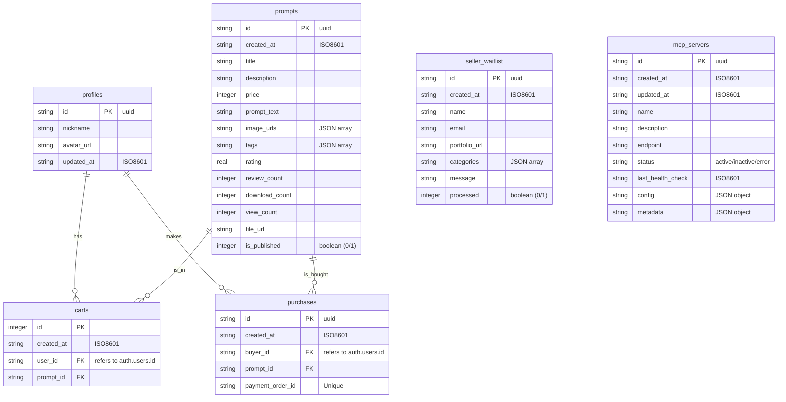

# SQLite Database Schema for Prompt Management

Database: `prompt_management.db`

## Entity Relationship Diagram

## Tables

### `profiles`
Stores user profile information.

| Column | Type | Description |
| :--- | :--- | :--- |
| `id` | `TEXT` | Primary Key. UUID. |
| `nickname` | `TEXT` | User's nickname. |
| `avatar_url` | `TEXT` | URL to user's avatar image. |
| `updated_at` | `TEXT` | ISO8601 timestamp of last update. |

### `prompts`
Stores prompt product information.

| Column | Type | Description |
| :--- | :--- | :--- |
| `id` | `TEXT` | Primary Key. UUID. |
| `created_at` | `TEXT` | ISO8601 timestamp of creation. |
| `title` | `TEXT` | Title of the prompt. |
| `description` | `TEXT` | Description of the prompt. |
| `price` | `INTEGER` | Price of the prompt. |
| `prompt_text` | `TEXT` | The actual prompt content. |
| `image_urls` | `TEXT` | JSON array of image URLs. Default `[]`. |
| `tags` | `TEXT` | JSON array of tags. Default `[]`. |
| `rating` | `REAL` | Average rating. Default `0`. |
| `review_count` | `INTEGER` | Number of reviews. Default `0`. |
| `download_count` | `INTEGER` | Number of downloads. Default `0`. |
| `view_count` | `INTEGER` | Number of views. Default `0`. |
| `file_url` | `TEXT` | URL for the downloadable file (for buyers). |
| `is_published` | `INTEGER` | Boolean (0 or 1). Whether the prompt is published. Default `1`. |

### `carts`
Stores items in user's shopping cart.

| Column | Type | Description |
| :--- | :--- | :--- |
| `id` | `INTEGER` | Primary Key. Auto-increment. |
| `created_at` | `TEXT` | ISO8601 timestamp of addition. |
| `user_id` | `TEXT` | UUID of the user (refers to `auth.users.id`). |
| `prompt_id` | `TEXT` | Foreign Key. UUID of the prompt. |

**Constraints:**
- `UNIQUE(user_id, prompt_id)`: Prevents duplicate items in the cart.
- `FOREIGN KEY (prompt_id) REFERENCES prompts(id) ON DELETE CASCADE`

### `purchases`
Stores purchase history.

| Column | Type | Description |
| :--- | :--- | :--- |
| `id` | `TEXT` | Primary Key. UUID. |
| `created_at` | `TEXT` | ISO8601 timestamp of purchase. |
| `buyer_id` | `TEXT` | UUID of the buyer (refers to `auth.users.id`). |
| `prompt_id` | `TEXT` | Foreign Key. UUID of the prompt. |
| `payment_order_id` | `TEXT` | Unique Toss Payments order ID. |

**Constraints:**
- `FOREIGN KEY (prompt_id) REFERENCES prompts(id) ON DELETE CASCADE`

### `seller_waitlist`
Stores applications for seller status.

| Column | Type | Description |
| :--- | :--- | :--- |
| `id` | `TEXT` | Primary Key. UUID. |
| `created_at` | `TEXT` | ISO8601 timestamp of application. |
| `name` | `TEXT` | Applicant's name. |
| `email` | `TEXT` | Applicant's email. |
| `portfolio_url` | `TEXT` | URL to applicant's portfolio. |
| `categories` | `TEXT` | JSON array of interested categories. Default `[]`. |
| `message` | `TEXT` | Message from the applicant. |
| `processed` | `INTEGER` | Boolean (0 or 1). Whether the application has been processed. Default `0`. |

### `mcp_servers`
Stores Model Context Protocol (MCP) server configurations.

| Column | Type | Description |
| :--- | :--- | :--- |
| `id` | `TEXT` | Primary Key. UUID. |
| `created_at` | `TEXT` | ISO8601 timestamp of creation. |
| `updated_at` | `TEXT` | ISO8601 timestamp of last update. |
| `name` | `TEXT` | Name of the MCP server. |
| `description` | `TEXT` | Description of the server. |
| `endpoint` | `TEXT` | Endpoint URL. |
| `status` | `TEXT` | Status (`active`, `inactive`, `error`). Default `inactive`. |
| `last_health_check` | `TEXT` | ISO8601 timestamp of last health check. |
| `config` | `TEXT` | JSON object for configuration. |
| `metadata` | `TEXT` | JSON object for metadata. |

## Indexes

- `idx_profiles_id` on `profiles(id)`
- `idx_prompts_id` on `prompts(id)`
- `idx_prompts_is_published` on `prompts(is_published)`
- `idx_carts_user_id` on `carts(user_id)`
- `idx_carts_prompt_id` on `carts(prompt_id)`
- `idx_purchases_buyer_id` on `purchases(buyer_id)`
- `idx_purchases_prompt_id` on `purchases(prompt_id)`
- `idx_purchases_payment_order_id` on `purchases(payment_order_id)`
- `idx_seller_waitlist_processed` on `seller_waitlist(processed)`
- `idx_mcp_servers_status` on `mcp_servers(status)`